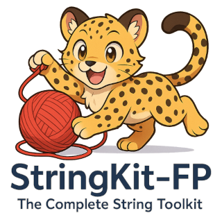

# 🧵 StringKit-FP: The Complete String Toolkit

[](https://www.freepascal.org/)
[](https://www.lazarus-ide.org/)
[](LICENSE.md)
[](docs/)
[](tests/)
[]()
[]()


<p align="center">
  
</p>


## 🧵 Why Choose StringKit-FP?

Professional string toolkit featuring advanced algorithms: Levenshtein/Jaro similarity, Soundex/Metaphone phonetics, readability scoring, regex patterns, HTML/URL encoding, and comprehensive validation. Static API, no instantiation required.

**🎯 Key Advantages:**

- 🧶 **Comprehensive**: 90+ string operations covering validation, transformation, analysis, and encoding
- 🪡 **Zero Dependencies**: Uses only standard Free Pascal RTL - no external libraries required
- 📏 **Advanced Analysis**: Readability scoring, n-gram generation, and statistical text analysis
- 🔍 **Robust Validation**: Regex patterns, format checking, and custom validation rules
- 🌐 **Web-Ready**: URL encoding, HTML escaping, and modern web standards support
- 🧪 **Thoroughly Tested**: Comprehensive test suite ensuring reliability in production
- ⚡ **Simple API**: Static methods - no object instantiation required, just call and use

## ✨ Feature Overview

### 🎭 **Case Conversion & Formatting**

*Professional text styling and formatting*

- `ToUpper()`, `ToLower()`, `ToTitleCase()` - Standard case transformations
- `ToCamelCase()`, `ToPascalCase()`, `ToSnakeCase()`, `ToKebabCase()` - Modern naming conventions
- `PadLeft()`, `PadRight()`, `PadCenter()` - Text alignment with custom padding
- `Truncate()` - Smart text truncation with ellipsis support
- `CapitalizeText()` - Intelligent word capitalization

### 🔍 **Validation & Pattern Matching**

*Robust string validation and pattern extraction*

- `IsValidEmail()`, `IsValidURL()`, `IsValidIP()` - Comprehensive format validation
- `IsValidDate()` - Date validation with custom format support
- `MatchesPattern()` - Powerful regex pattern matching
- `ExtractMatches()`, `ExtractAllMatches()` - Extract matching substrings

### 🧬 **Similarity & Fuzzy Matching**

*Advanced string comparison algorithms*

- `LevenshteinDistance()`, `LevenshteinSimilarity()` - Edit distance calculations
- `HammingDistance()` - Character-by-character comparison for equal-length strings
- `JaroSimilarity()`, `JaroWinklerSimilarity()` - Sophisticated similarity metrics
- `LongestCommonSubsequence()`, `LCSSimilarity()` - Common subsequence analysis
- `IsFuzzyMatch()` - Multi-algorithm fuzzy string matching

### 🎵 **Phonetic Matching**

*Sound-based string comparison algorithms*

- `Soundex()` - Russell-Odell phonetic algorithm for name matching
- `Metaphone()` - Advanced English pronunciation-based matching

### 🏛️ **Number Formatting**

*Professional number and numeric string handling*

- `ToRoman()`, `FromRoman()` - Roman numeral conversion (1-3999)
- `FormatFileSize()` - Human-readable file size formatting (B, KB, MB, GB, TB)
- `FormatNumber()`, `FormatFloat()` - Thousand-separator formatting
- `ToOrdinal()` - Ordinal number formatting (1st, 2nd, 3rd...)
- `NumberToWords()` - Convert numbers to English words

### 🌐 **Encoding & Web Utilities**

*Web-safe string encoding and decoding*

- `HTMLEncode()`, `HTMLDecode()` - HTML entity encoding for safe web output
- `URLEncode()`, `URLDecode()` - URL parameter encoding/decoding
- `HexEncode()`, `HexDecode()` - Hexadecimal string conversion

### 📊 **Text Analysis**

*Statistical analysis and text insights*

- `CountWords()`, `GetWords()` - Word counting and extraction
- `FleschKincaidReadability()` - Readability scoring for content assessment
- `GenerateNGrams()` - N-gram generation for linguistic analysis

### 🛠️ **String Utilities**

*Essential string manipulation operations*

- `Split()`, `Join()` - String splitting and joining operations
- `ReplaceText()`, `ReplaceRegEx()` - Text replacement with regex support
- `Contains()`, `StartsWith()`, `EndsWith()` - String content inspection
- `CollapseWhitespace()`, `RemoveWhitespace()` - Whitespace normalization
- `DuplicateText()`, `ReverseText()` - String duplication and reversal
- `GetLength()`, `SubString()`, `LeftStr()`, `RightStr()` - String length and extraction
- `CountSubString()` - Substring occurrence counting

## 🧶 Installation (Lazarus IDE)

*Quick setup for Lazarus development*

1. **Clone the repository**:

```bash
git clone https://github.com/ikelaiah/stringkit-fp
```

2. **Open your project** - Open/start a new project in Lazarus IDE

3. **Add the package** - Go to `Package` → `Open Package File (.lpk)...`

4. **Select the package** - Navigate to the StringKit packages in the `packages/lazarus/` folder and select `stringkit_fp.lpk`

5. **Compile the package** - In the package window that opens, click `Compile`

6. **Install to project** - Click `Use → Add to Project` to install the package

✅ **Installation complete!** StringKit is now available in your Lazarus project.

## 🧵 Manual Installation (General)

*Alternative setup method*

1. **Clone the repository**:

```bash
git clone https://github.com/ikelaiah/stringkit-fp
```

2. **Configure your project** - Add the source directory to your project's search path.


## 🧵 Usage

*Import StringKit into your project*

```pascal
uses
  // String manipulation library
  StringKit;           // All string operations
```

## 🎨 Start Weaving: Quick Thread Patterns

### 🎨 **Thread Dyeing & Styling**
*Transform your raw strings into beautifully styled threads*

```pascal
var
  Text: string;
begin
  // Case conversions
  Text := TStringKit.ToCamelCase('hello world');     // Returns: 'helloWorld'
  Text := TStringKit.ToPascalCase('hello world');    // Returns: 'HelloWorld'
  Text := TStringKit.ToSnakeCase('HelloWorld');      // Returns: 'hello_world'
  Text := TStringKit.ToKebabCase('HelloWorld');      // Returns: 'hello-world'
  Text := TStringKit.ToTitleCase('hello world');     // Returns: 'Hello World'
  
  // Padding and formatting
  Text := TStringKit.PadLeft('123', 8, '0');         // Returns: '00000123'
  Text := TStringKit.PadRight('Name', 10, '.');      // Returns: 'Name......'
  Text := TStringKit.PadCenter('Hi', 10, '-');       // Returns: '----Hi----'
  Text := TStringKit.Truncate('Very long text', 10); // Returns: 'Very lo...'
  Text := TStringKit.CapitalizeText('hello world');  // Returns: 'Hello World'
end;
```

### 🔍 **Quality Control & Pattern Weaving**
*Inspect your threads and extract beautiful patterns*

```pascal
var
  Matches: TMatchesResults;
  AllMatches: TMatchStrings;
  i: Integer;
begin
  // Built-in validators
  if TStringKit.IsValidEmail('user@example.com') then
    WriteLn('Valid email');
  if TStringKit.IsValidURL('https://example.com') then
    WriteLn('Valid URL');
  if TStringKit.IsValidIPv4('192.168.1.1') then
    WriteLn('Valid IPv4');
  if TStringKit.IsValidDate('2023-12-25', 'yyyy-mm-dd') then
    WriteLn('Valid date');
    
  // Pattern matching and extraction
  if TStringKit.MatchesPattern('ABC123', '^[A-Z]{3}\d{3}$') then
    WriteLn('Matches pattern');
    
  // Extract all matches with position info
  Matches := TStringKit.ExtractMatches('Call 555-1234 or 555-5678', '\d{3}-\d{4}');
  for i := 0 to High(Matches) do
    WriteLn(Format('Found: %s at position %d', [Matches[i].Text, Matches[i].Position]));
    
  // Extract just the matched text
  AllMatches := TStringKit.ExtractAllMatches('Emails: a@b.com, c@d.net', '\w+@\w+\.\w+');
  for i := 0 to High(AllMatches) do
    WriteLn('Email: ' + AllMatches[i]);
end;
```

### 🧬 **Thread Similarity Analysis**
*Compare and measure the likeness between different thread types*

```pascal
var
  Distance: Integer;
  Similarity: Double;
begin
  // String distance algorithms
  Distance := TStringKit.LevenshteinDistance('kitten', 'sitting'); // Returns: 3
  Distance := TStringKit.HammingDistance('karolin', 'kathrin');     // Returns: 3
  
  // Similarity ratios (0.0 to 1.0)
  Similarity := TStringKit.LevenshteinSimilarity('test', 'best');   // Returns: ~0.75
  Similarity := TStringKit.JaroSimilarity('MARTHA', 'MARHTA');      // Returns: ~0.94
  Similarity := TStringKit.JaroWinklerSimilarity('MARTHA', 'MARHTA'); // Higher than Jaro
  
  // Fuzzy matching with threshold
  if TStringKit.IsFuzzyMatch('apple', 'appel', 0.8) then
    WriteLn('Close match found');
    
  // Longest common subsequence
  WriteLn(TStringKit.LongestCommonSubsequence('ABCDEFG', 'ABDZEFXG')); // Returns: 'ABDEG'
end;
```

### 🎵 **Sound Thread Identification**
*Match threads by their sonic fingerprint*

```pascal
var
  Code1, Code2: string;
begin
  // Soundex for name matching
  Code1 := TStringKit.Soundex('Robert');  // Returns: 'R163'
  Code2 := TStringKit.Soundex('Rupert');  // Returns: 'R163'
  if Code1 = Code2 then
    WriteLn('Names sound similar');
    
  // Metaphone for pronunciation
  Code1 := TStringKit.Metaphone('knight');   // Returns: 'NT'
  Code2 := TStringKit.Metaphone('night');    // Returns: 'NT'
  if Code1 = Code2 then
    WriteLn('Words sound the same');
end;
```

### 🏛️ **Number Thread Artistry**
*Spin numbers into elegant, readable thread patterns*

```pascal
var
  Roman: string;
  Number: Integer;
  Formatted: string;
begin
  // Roman numerals
  Roman := TStringKit.ToRoman(1994);        // Returns: 'MCMXCIV'
  Number := TStringKit.FromRoman('MCMXCIV'); // Returns: 1994
  
  // File size formatting
  Formatted := TStringKit.FormatFileSize(1048576);    // Returns: '1.00 MB'
  Formatted := TStringKit.FormatFileSize(1500000000); // Returns: '1.40 GB'
  
  // Number formatting
  Formatted := TStringKit.FormatNumber(1234567);           // Returns: '1,234,567'
  Formatted := TStringKit.FormatFloat(12345.67, 2);       // Returns: '12,345.67'
  Formatted := TStringKit.FormatFloat(1234.5, 3, ',', '.'); // Returns: '1.234,500'
  
  // Ordinal and word conversion
  Formatted := TStringKit.ToOrdinal(21);              // Returns: '21st'
  Formatted := TStringKit.NumberToWords(123);         // Returns: 'one hundred and twenty-three'
end;
```

### 🌐 **Web Thread Preparation**
*Ready your threads for the digital tapestry of the web*

```pascal
var
  Encoded, Decoded: string;
begin
  // HTML encoding for safe web content
  Encoded := TStringKit.HTMLEncode('<p class="bold">Text</p>');
  // Returns: '&lt;p class=&quot;bold&quot;&gt;Text&lt;/p&gt;'
  
  Decoded := TStringKit.HTMLDecode('&lt;p&gt;Hello &amp; World&lt;/p&gt;');
  // Returns: '<p>Hello & World</p>'
  
  // URL encoding for web parameters
  Encoded := TStringKit.URLEncode('Hello World!');     // Returns: 'Hello+World%21'
  Decoded := TStringKit.URLDecode('Hello+World%21');   // Returns: 'Hello World!'
  
  // Hexadecimal encoding
  Encoded := TStringKit.HexEncode('Hello');            // Returns: '48656C6C6F'
  Decoded := TStringKit.HexDecode('48656C6C6F');       // Returns: 'Hello'
end;
```

### 📊 **Thread Analysis & Insights**
*Examine your woven text like a master craftsperson*

```pascal
var
  WordCount: Integer;
  Readability: Double;
  NGrams: TMatchStrings;
  i: Integer;
begin
  // Basic text statistics
  WordCount := TStringKit.CountWords('Hello, world! How are you?'); // Returns: 5
  
  // Readability scoring (0-100, higher = easier)
  Readability := TStringKit.FleschKincaidReadability('The quick brown fox jumps.');
  WriteLn(Format('Readability score: %.1f', [Readability]));
  
  // N-gram generation for NLP
  NGrams := TStringKit.GenerateNGrams('the quick brown fox', 2); // Bigrams
  for i := 0 to High(NGrams) do
    WriteLn('Bigram: ' + NGrams[i]);
  // Output: 'the quick', 'quick brown', 'brown fox'
end;
```

### 🛠️ **Master Weaver's Essential Tools**
*The fundamental techniques every string artisan must know*

```pascal
var
  Parts: TMatchStrings;
  Joined: string;
  i: Integer;
begin
  // Splitting and joining
  Parts := TStringKit.Split('apple,banana,cherry', ',');
  for i := 0 to High(Parts) do
    WriteLn('Part: ' + Parts[i]);
    
  Joined := TStringKit.Join(Parts, ' | '); // Returns: 'apple | banana | cherry'
  
  // Text replacement
  Joined := TStringKit.ReplaceText('Hello World', 'World', 'Pascal');
  // Returns: 'Hello Pascal'
  
  Joined := TStringKit.ReplaceRegEx('Phone: 123-456-7890', '(\d{3})-(\d{3})-(\d{4})', '($1) $2-$3');
  // Returns: 'Phone: (123) 456-7890'
  
  // String testing
  if TStringKit.StartsWith('Hello World', 'Hello') then
    WriteLn('Starts with Hello');
  if TStringKit.EndsWith('test.txt', '.txt') then
    WriteLn('Is a text file');
  if TStringKit.Contains('Hello World', 'World') then
    WriteLn('Contains World');
    
  // Text cleaning
  Joined := TStringKit.CollapseWhitespace('  Multiple   spaces  '); // Returns: ' Multiple spaces '
  Joined := TStringKit.RemoveWhitespace('  No spaces  ');          // Returns: 'Nospaces'
  
  // String extraction and manipulation
  Joined := TStringKit.LeftStr('Hello World', 5);     // Returns: 'Hello'
  Joined := TStringKit.RightStr('Hello World', 5);    // Returns: 'World'
  Joined := TStringKit.SubString('Hello World', 7, 5); // Returns: 'World'
  Joined := TStringKit.DuplicateText('Hi! ', 3);      // Returns: 'Hi! Hi! Hi! '
  
  // String analysis
  WriteLn(TStringKit.GetLength('Hello'));             // Returns: 5
  WriteLn(TStringKit.CountSubString('ababab', 'ab')); // Returns: 3
end;
```


## 📖 System Requirements

### Tested Environments

| Module                          | Windows 11 | Ubuntu 24.04.2 |
|---------------------------------|------------|----------------|
| StringKit                 | ✅         | ✅             |

### Dependencies

- Windows
  - No external dependencies required
- Linux
  - No external dependencies required
- Uses only standard Free Pascal RTL units

### Build Requirements

- Free Pascal Compiler (FPC) 3.2.2+
- Lazarus 4.0+
- Basic development tools (git, terminal, etc)

## 📚 Documentation

For detailed documentation, see:

- 📋 [Cheat Sheet](docs/cheat-sheet.md)
- 📝 [Strings](docs/StringKit.Strings.md)
 

## 💬 Community & Support

- **Questions?** [Open a discussion](https://github.com/ikelaiah/stringkit-fp/discussions)
- **Found a bug?** [Report an issue](https://github.com/ikelaiah/stringkit-fp/issues)


## ✅ Testing

1. Open the `TestRunner.lpi` using Lazarus IDE
2. Compile the project
3. Run the Test Runner:

```bash
$ cd tests
$ ./TestRunner.exe -a --format=plain
```

## 🧭 **Future Weaving Patterns**

*Our roadmap for expanding the string artisan's toolkit*

- **🌍 International Thread Support**: Enhance multi-byte character weaving for global text tapestries
- **⚡ High-Speed Looms**: Optimize core algorithms for industrial-scale string processing
- **📦 Loom Integration**: Seamless support for Free Pascal and Lazarus package managers


## 🤝 **Join the Weaving Circle**

*Every master weaver started as an apprentice - your contributions help strengthen our tapestry!*

Contributions are warmly welcomed! Whether you're adding new thread patterns, fixing loose ends, or improving our weaving techniques, please feel free to submit a Pull Request. For major pattern changes, please open an issue first to discuss your vision.

1. **Fork the Loom** - Fork the Project
2. **Create your Pattern** - Create your Feature Branch (`git checkout -b feature/AmazingThreadPattern`)
3. **Weave your Changes** - Commit your Changes (`git commit -m 'Add beautiful new thread pattern'`)
4. **Share your Work** - Push to the Branch (`git push origin feature/AmazingThreadPattern`)
5. **Present to the Guild** - Open a Pull Request

## ⚖️ License

This project is licensed under the MIT License - see the [LICENSE](LICENSE.md) file for details.

## 🙏 **Honoring Our Thread Masters**

*Standing on the shoulders of giants who wove the foundation*

- **🏛️ The FPC Guild** - For crafting the magnificent Free Pascal loom
- **🧵 Fellow Weavers** - All contributors and maintainers who help strengthen our tapestry
- **🎨 String Artisans Everywhere** - The community that inspires continuous innovation


---

*🧶 **Ready to start weaving?** Your feedback helps us craft better tools! Visit our [thread workshop](https://github.com/ikelaiah/stringkit-fp/issues) to share ideas, report loose threads, or track our weaving progress.*

---

**✨ Happy String Weaving! ✨**

*"In every thread lies infinite possibility, in every string a story waiting to be told."*